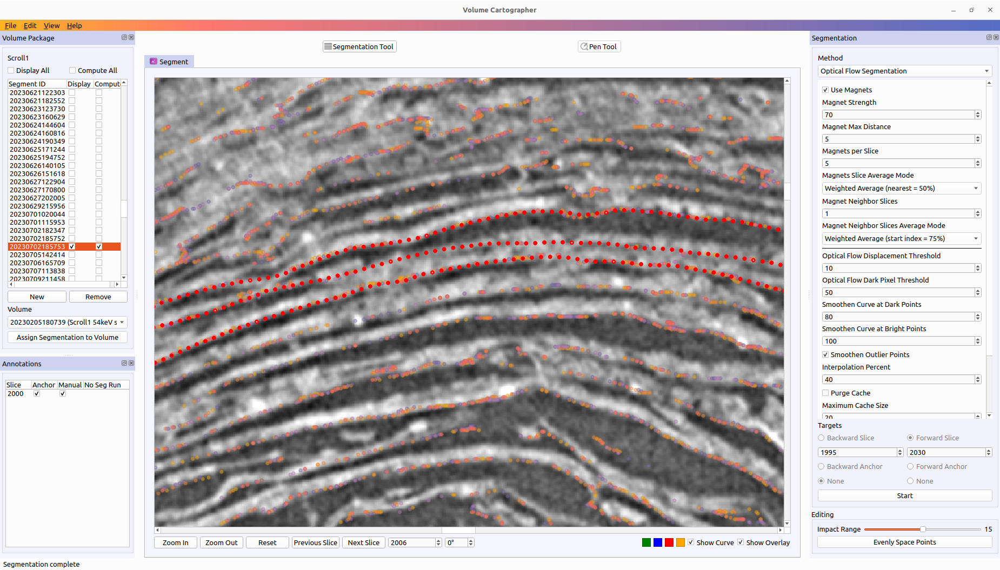

# Point Cloud Overlays & OFS Magnets

VC now supports to load and display PLY and OBJ point clouds, plus utilize them as segmentation magnets during OFS segmentation runs. This document outlines its usage and parameters.



## Point cloud loading and rendering
1.	Enabled the VC core logic to not only read ASCII PLY files, but also binary ones (not only for VC GUI but should work for all tools), as that is what Thaumato is outputting.

3.	For now there is only one supported option to load point clouds:
    * Specifying a path to a PLY/OBJ chunks directory via the `VC.ini` file (e.g. from Thaumato such as https://dl.ash2txt.org/full-scrolls/Scroll1/PHercParis4.volpkg/scroll1_surface_points/point_cloud_colorized_verso_subvolume_blocks/). Those chunks are read dynamically as required based on the shown scroll portion in the viewer window. Note that you need to unpack those TARs, VC will not do that on the fly.
    * In the next version, opening PLY/OBJ folders will be supported through the GUI.
    * Loading a single PLY/OBJ file as an overlay point cloud is also not supported yet, but will be added as well.

4.	Once you load a point cloud, you will see a popup to input the information about scaling, offset, axis, ... The fields are pre-filled with values matching the Thaumato output chunks.

5.	Once a point cloud was successfully loaded, its points will be overlayed on top of the slice images. You can toggle the rendering on/off via the checkbox below the viewer (next to the existing “Show Curve” checkbox) and also via the new keyboard shortcut “B”.

6.	There is no support yet for changing overlay user settings via the GUI, so for now that has to be manually done in the `VC.ini` file.
    * Everything in a new setting section `[overlay]`
    * `auto_open`: If set to “1”, the PLY/OBJ file or folder from `recent` will be automatically opened when you open a VOLPKG. If you switch between different scrolls, that might of course not match. Going forward, this will be improved.
    * `recent`: File or directory to be used for `auto_open`
    * `display_neighbor_slices`: Default = 1, means VC will not only render the points for the currently viewed slice, but also the ones from the slice above and below. The coloring matches the gradient from the VC header bar. Points from current slice are orange, the ones below go towards yellow, the ones above towards purple/blue. Valid values are 0 (no neighbor slices used), 1 or 2.
```
[overlay]
auto_open=1
recent=/scroll-3/dl.ash2txt.org/full-scrolls/Scroll1/PHercParis4.volpkg/scroll1_surface_points/point_cloud_colorized_verso_subvolume_blocks/
display_neighbor_slices=1
```

__Note:__ The first 5 slices from https://dl.ash2txt.org/full-scrolls/Scroll1/PHercParis4.volpkg/scroll1_surface_points/point_cloud_colorized_verso_subvolume_blocks/ are wrong and should be ignored for now.

## Use point cloud as magnets in OFS segmentation

If a point cloud is loaded, it can be used as an addition to the OFS algorithm to better guide it through the scrolls. This allows longer segmentation runs while keeping the curves on the papyrus. The point cloud points serve as magnets to pull on the OFS output points.

Corresponding new parameters have been added to the OFS segmentation panel:
1. Use Magnet: Toggles the magnet logic on/off
2. Magnet Strength: Strength with which the magnets pull the OFS points towards them. 70 means, that the OFS point will be pulled 70% of the distance delta between magnet and OFS point.
3. Magnet Max Distance: How far a potential magnet point may be away from the OFS point, in order to be relevant for pulling.
4. Magnets per Slice: How many magnets will be considered per slice.
5. Magnets Slice Average Mode: Determines how the relevant magnets will be combined.
    * Linear Average: Gives the same weight to each magnet
    * Weighted Average: Gives the highest weight to the nearest magnet, and then halves the weight for next magnet and so on. There are two variants, one where the first magnet weight is 50% and one with 75%.
6. Magnet Neighbor Slices: How many slices besides the one that OFS is currently being run for, should be used to look for magnets. A value of 1, means that one slice above and one below will be considered, 2 means two slices above and below and so on.
7. Magnet Neighbor Slices Average Mode: If neighbor slices are used, then for each slice the magnet determination runs based on the provided parameters. At the end that means for each considered slice we have one magnet point (might be a virtual one if multiple magnets on the slice were averaged together). This parameter controls, how those virtual magnets for each slice will be now averaged to get the final magnet that then actually pulls on the OFS point.
    * Linear Average: Gives the same weight to each magnet
    * Weighted Average: Gives the highest weight to the magnet on the slice OFS is currently running on, then half of that for the direct neighbors (one slice above and below, which means they effectively get a quarter each), then again half to the next further away neighbor pair (so an eight each) and so on
    * Nearest Only. Selects the nearest magnet of all the virtual slice magnets and only uses that one to pull the OFS point
