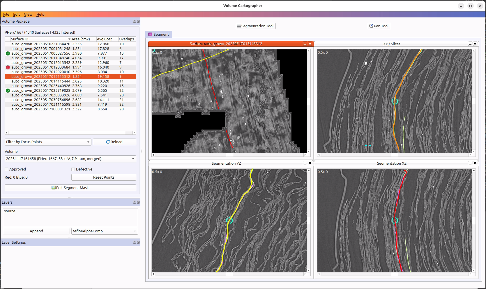

# Changes VC3D May 2025

I tackled various wish list items and implemented multiple improvements for VC3D to support the ongoing effort of improved and more efficient segmentation. All changes are merged into https://github.com/ScrollPrize/volume-cartographer

## User Interface (UI/UX)
- Added “Reload” button to surface list ([from original "Villa" wishlist issue](https://github.com/ScrollPrize/villa/issues/196))
- Ensured that active filter now correctly updates surface list when setting a focus point
- Added new sortable columns to surface list (cm2 area, avg. solver cost, number of overlaps, icon column for “approved” & “defective”) ([GH issue-3](https://github.com/ScrollPrize/volume-cartographer/issues/3))
-	Added proper user-friendly names for sub views
-	Added different colors for focus point intersection lines to visually match to YZ and XZ sub views (previously all yellow and not clear to user which is which)
-	Removed closing button from sub views (as there is no way to get the views back)
-	Added “Reset Segmentation Views” menu option to restore initial layout
-	Added dock widget show/hide actions to “View” menu
-	Show current surface ID in segmentation MDI window title
-	Show counter of overall surfaces and number of filtered/hidden ones

## Improvements
-	Improved performance ([GH issue-7](https://github.com/ScrollPrize/volume-cartographer/issues/7)) (e.g. no longer creating and deleting tree items, prevented internal data copying, …)
-   Improved stability (e.g. users can now safely change volpkgs and fixed other crashes that could occur from UI, e.g. layer settings are now hidden/empty until there is actually a layer selcted, thus preventing crashing when user marks the "Layer enabled" checkbox) ([GH issue-9](https://github.com/ScrollPrize/volume-cartographer/issues/9))
-	Fixed bad `assert()` blocker that prevented trace generation in debug mode
-	Inform users about existing `QuadSurface` path during saving (rather than generic file exception)
-	Auto delete `z_dgb_gen_` folders during trace generation
-	Ensured that trace results get written correctly into `auto_trace_` folder with timestamp
-	Catch `cv::Mat` errors during trace generation to properly end the process rather than crashing out

## Coding / infrastructure
-	Prevented memory leaks in multiple VC3D command line tools (such as  `vc_grow_seg_from_segments`) as well as in VC3D itself ([GH issue-16](https://github.com/ScrollPrize/volume-cartographer/issues/16))
-	Added Github build / CI actions that create Docker containers and upload to ghrc.io ([GH issue-10](https://github.com/ScrollPrize/volume-cartographer/issues/10))
-	Ensured compatibility with Ubuntu 25.04 & QT 6.8 (resolved surface tree widget promotion path problem in QtDesigner)
-	Improve console output (added missing blanks, clearer messages)
-	Fixed some code warnings
